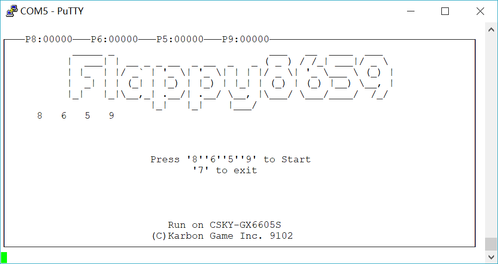

Flappy8659-Run-On-C-SKY-gx6605s-dev-board
===
a simple flappybird-like game run on C-SKY gx6605s dev board



# Catalog
* [Hardware Requirement](#hardware-requirement)
* [Introduction](#introduction)
* [Compile and Run](#compile-and-run)

## Hardware Requirement

* [C-SKY gx6605s dev board](https://c-sky.github.io/docs/gx6605s.html "C-SKY gx6605s dev board")
* Another device to run an UART console (like [PuTTY](https://putty.org "PuTTY") etc.)

## Introduction


## Compile and Run
* Compile (on Ubuntu 16.04)
```Bash
csky-linux-gcc flappyBirdByCSY.c -lpthread -o out flappy8659
```
Then mv the output file to board.
* Run (on dev board)
```Bash
./flappy8659
```
